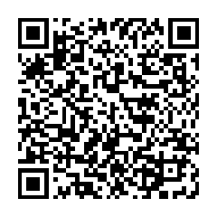

Table of contents
===============================================================

-   [The Adobe problem](#the-adobe-problem)
    -   [Introduction](#introduction)
    -   [Subscription-only model](#subscription-only-model)
    -   [Adobe monopoly status](#adobe-monopoly-status)
    -   [Software Patents use](#software-patents-use)
    -   [Anti-patterns](#anti-patterns)
-   [The Solution](#the-solution)
    -   [Phase 1, reproducible scripts](#phase-1-reproducible-scripts)
    -   [Phase 2, Interopebility
        plugins](#phase-2-interopebility-plugins)
    -   [Phase 3, maintain friendly
        forks](#phase-3-maintain-friendly-forks)
-   [How to help](#how-to-help)
    -   [Donate](#donate)
    -   [Volunteering](#volunteering)
-   [Accepted Applications](#accepted-applications)
-   [Footnotes](#footnotes)
    -   [Extra links](#extra-links)

The Adobe problem
=================

If you already know why Adobe is morally questionable you can skip to
the solution part.

### Introduction

In the digital creative space, Adobe is the main company \"selling\"
creative applications like the popular Adobe Photoshop or Adobe
Illustrator, Adobe has been critiqued for many unethical practices, some
of which are documented below.

### Subscription-only model

In 2013 Adobe went from selling to a full licensing model to massive
community outcry[^1] [^2], having a subscription only model is a big
disservice for students and non-professionals who most always can\'t
afford to license such software for their endevors[^3], a byproduct of
the model is the not having the ability to access files from proprietary
file formats[^4]

### Adobe monopoly status

Adobe is a monopoly with software like Photoshop with **90%**[^5]
marketshare, therefore they can price their products however they like
and they have done so[^6], they also buy competitors like Figma[^7] to
preserve their market dominance instead of competing.

### Software Patents use

As a company, Adobe holds multiple software patents for application
specific features like \"Image foreground detection\"[^8] or \"GUI
Locking\"[^9] etc, this is regarded as unethical by many people by the
fact that this legally prevents competitors from implementing the same
features.

### Anti-patterns

Adobe has been accused of tricking customers into a 12 month month
contract[^10], Adobe enrolling users into the subscription model using
the free trial[^11], charging a subscription cancellation fee[^12],
etc[^13].

The Solution
============

As i have said before OpenCreativity\'s sole goal is to be the
interoperability layer between creative free & open source applications,
here is a roadmap on how we can do that.

Phase 1, GUI launcher
-----------------------------

A GUI launcher similar to Steam but only for creative applications where you can download or delete a program inside of it, thereby simplifying the user experience for package management.

Phase 2, Interopebility plugins
-------------------------------

Once we have written all the scripts we can move to creating (and
mantaining) plugins between applications that don\'t have them so that
they can communicate and work together seamlessly.

Phase 3, maintain friendly forks
--------------------------------

If the previous phases aren\'t enough, we can then fork and have small
necessary changes to achieve our goals like a consistent UI.

How to help
===========

Donate
------

I would really appreciate donations, it would help me spend more time on
the project, you can donate here:

-   Liberapay: <https://liberapay.com/OpenCreativity>
-   Buymeacoffee: <https://www.buymeacoffee.com/schola>

### Cryptocurrency

If you prefer cryptocurrency, you can donate with:

-   Monero:



-   Address:
    445DuRRwp3HAMQEQ5RTTkBAGyid3v66PNBGtbArZh1VgMsrZhxi5dBWSK2HMeu1gtriRJkhPjAtmU3LEopUuAb4NUGSWgiT
-   Bitcoin:


-   Address: 15CJagpVKQHmK8QA45JW6G1VBnAwaXFnzq

Volunteering
------------

If you are interested in the project, I can add you as a member of the
organization, open a GitHub issue and we can discuss.

Accepted Applications
=====================

Others can be discussed in Github Discussions.

| Adobe          | Photoshop | Lightroom |
| OpenCreativity | GIMP      | Darktable |
	
Footnotes
=========

Extra links
-----------

-   Deadobe: <https://github.com/scholablade/Deadobe>
-   Adobe-related video: <https://www.youtube.com/watch?v=jIM6dN3ogbk>
-   Adobe Deceptive patterns:
    <https://www.deceptive.design/hall-of-shame>

[^1]: ``` {.example}
 [Adobe's Creative Cloud Move Causes Outcry And Confusion](https:https://www.forbes.com/sites/adriankingsleyhughes/2013/05/09/adobes-creative-cloud-move-causes-outcry-and-confusion/?sh=74de7df26925)
    ```

    interoperability

[^2]: ``` {.example}
    [Why Adobe's Subscription-Only Plan Sucks](https:https://wedesignstudios.com/why-adobes-subscription-only-plan-sucks)
    ```

[^3]: ``` {.example}
    [Why Adobe's Subscription-Only Plan Sucks](https:https://wedesignstudios.com/why-adobes-subscription-only-plan-sucks)
    ```

[^4]: ``` {.example}
    [Adobe casts cloud on budgets](https:https://www.columbian.com/news/2013/jun/02/adobe-casts-cloud-on-budgets/)
    ```

[^5]: ``` {.example}
    [Essential Adobe Photoshop Statistics in 2023](https:https://zipdo.co/statistics/adobe-photoshop/)
    ```

[^6]: ``` {.example}
    [‘This is fine’: On the cost of Creative Cloud](https:https://www.booknetcanada.ca/blog/2017/12/6/this-is-fine-on-the-cost-of-creative-cloud)
    ```

[^7]: ``` {.example}
    [Adobe Near Deal for Online Design Startup Figma, Sources Say](https:https://www.bloomberg.com/news/articles/2022-09-15/adobe-is-said-to-near-deal-to-buy-online-design-startup-figma)
    ```

[^8]: ``` {.example}
    [Image foreground detection](https:https://patents.google.com/patent/US9299004B2/en?oq=US9299004B2)
    ```

[^9]: ``` {.example}
    [Snapping of object features via dragging](https:https://patents.google.com/patent/US10061496B2/en?oq=US10061496b2)
    ```

[^10]: ``` {.example}
     [How Adobe tricks users into a 12 month contract.](https:https://twitter.com/darkpatterns/status/1489901640777973768#m)
    ```

[^11]: ``` {.example}
    [Adobe enrolls users into the subscription model using free trial](https:https://nitter.net/MikeCalcagno/status/1676525562930806788#)
    ```

[^12]: ``` {.example}
    [Adobe charges subscription cancellation fee](https:https://web.archive.org/web/20230227031707/https://twitter.com/MRDADDGUY/status/1381628427246039045)
    ```

[^13]: ``` {.example}
    [Adobe interupts users with large pop-up ad they press "Save" in Adobe illustrator, a product they have already paid for.](https:https://nitter.net/cabel/status/1552409998684086273#m)
    ```
